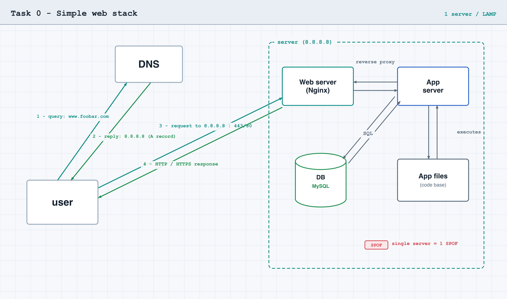

# Task 0 — Simple web stack

## What the task asks

Design, on a whiteboard, a one-server web infrastructure that hosts
`www.foobar.com`. Start the explanation from a user wanting to reach the site.

Required elements:

- 1 domain name `foobar.com` with a `www` record pointing to the server IP `8.8.8.8`
- 1 server containing: 1 web server (Nginx), 1 application server, 1 set of
  application files (codebase), 1 database (MySQL)

You must be able to explain each component, how the server talks to the user, and
the issues of this infrastructure.

## Diagram

## Explanations

| Question | Answer |
|----------|--------|
| What is a server | A machine/program that provides a service to clients over the network; a role, not necessarily a dedicated box |
| Role of the domain name | Maps a memorable name to the server's IP via DNS |
| DNS record type of `www` | An `A` record — its value is an IPv4 address (a `CNAME` would point to another name) |
| Role of the web server | Handles HTTP, serves static content, reverse-proxies dynamic requests to the app server |
| Role of the application server | Runs the codebase to generate dynamic pages |
| Role of the database | Stores persistent data; the app queries it over SQL |
| Server ↔ user communication | HTTP/HTTPS over TCP/IP |

## Issues

| Issue | Why |
|-------|-----|
| SPOF | The single server's failure takes the whole site down |
| Downtime on maintenance | Deploying code / restarting the web server takes the site offline |
| Cannot scale | Bound by one machine's capacity; no room to add power |

## Answer file

`0-simple_web_stack` holds the URL of this diagram's screenshot.
