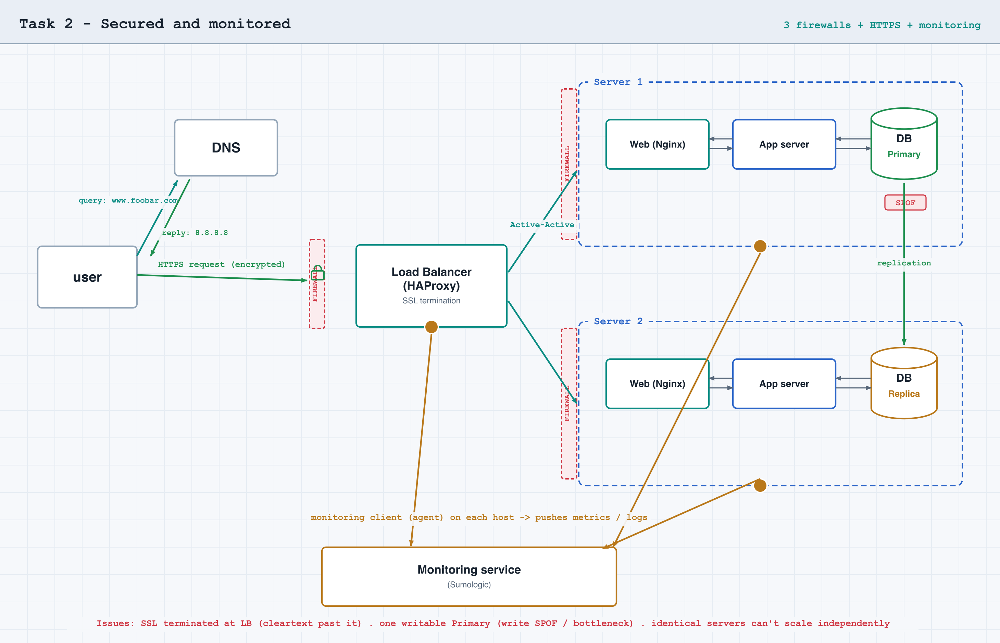

# Task 2 — Secured and monitored web infrastructure

## What the task asks

Take the Task 1 design and make it secured, serving encrypted traffic, and
monitored.

Required additions over Task 1:

- 3 firewalls (one per server)
- 1 SSL certificate to serve `www.foobar.com` over HTTPS
- 3 monitoring clients (data collectors for Sumologic or another service)

You must be able to explain why each element is added, what firewalls are for,
why traffic is served over HTTPS, what monitoring is for and how it collects
data, how to monitor the web server's QPS, and the issues of this infrastructure.

## Diagram

## Explanations

| Added element | Why it's added |
|---------------|----------------|
| 3 firewalls | Allow only needed traffic per server; defense in depth |
| SSL certificate (HTTPS) | Encrypts traffic, authenticates the server, protects integrity |
| 3 monitoring clients | Collect metrics/logs from each server for visibility and alerting |

| Question | Answer |
|----------|--------|
| What firewalls are for | Allow or deny traffic by rules (IP, port, direction); default-deny, open only what's needed |
| Why HTTPS | Confidentiality (encryption), integrity, and authentication over an untrusted network |
| What monitoring is for | Visibility into availability, performance, and capacity; alerting before users notice |
| How the monitoring tool collects data | An agent on each server gathers metrics/logs locally and pushes them to a monitoring service |
| How to monitor web server QPS | Point the agent at the web server's access log (or `stub_status`), count requests per second, report the rate with an alert threshold |

## Issues

| Issue | Why |
|-------|-----|
| SSL terminated at the load balancer | Past the LB the traffic is cleartext inside the network — no longer end-to-end encrypted |
| One writable MySQL | The Primary is a write SPOF and a write bottleneck; reads scale, writes don't |
| Identical servers (web+app+DB each) | Components contend for resources and can't be scaled independently |

## Answer file

`2-secured_and_monitored_web_infrastructure` holds the URL of this diagram's
screenshot.
