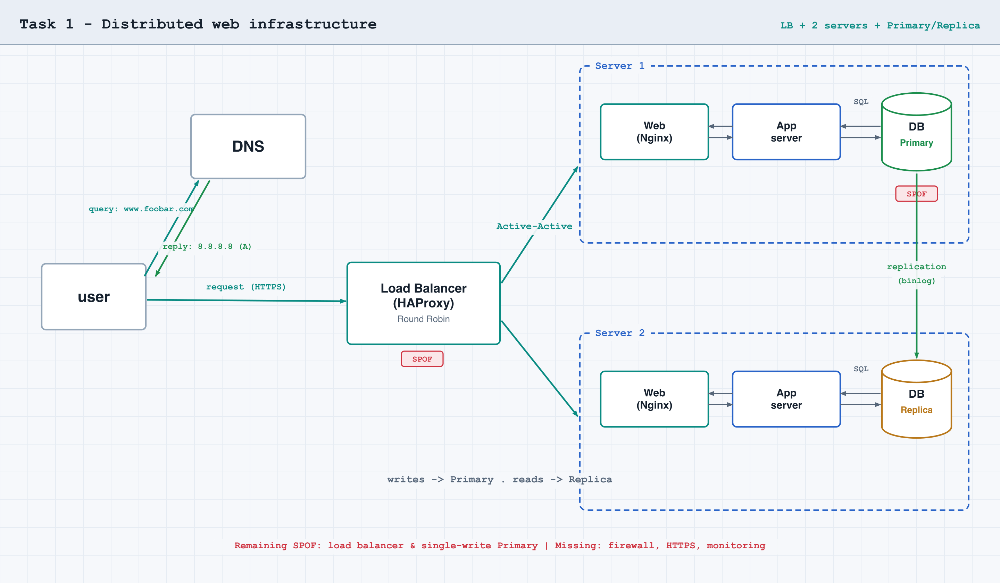
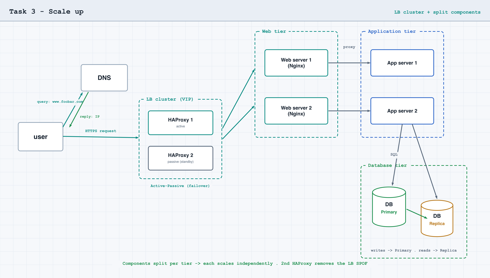

# Web infrastructure design

Whiteboarding project. Four diagrams of the same website (`www.foobar.com`),
each adding redundancy, security, observability, or scale to the previous one.
Each task has its own markdown file holding the requirements, the diagram, and
the explanations, plus the rendered diagram as a `.png`.

## What this covers

| Component | Role |
|-----------|------|
| Domain name | Human-friendly name mapped to a server IP via DNS |
| DNS `A` record | Maps a name directly to an IPv4 address (`www` → `8.8.8.8`) |
| Server | A machine/program serving clients over the network — a role, not a box |
| Web server (Nginx) | Handles HTTP, serves static files, reverse-proxies dynamic requests |
| Application server | Runs the codebase to generate dynamic pages |
| Application files | The codebase the application server executes |
| Database (MySQL) | Stores persistent data, queried over SQL |
| Load balancer (HAProxy) | Distributes requests across servers, health-checks backends |
| Primary-Replica | One writable DB (Primary) + read-only copies (Replicas) |
| Firewall | Allows/denies traffic by rule (IP, port, direction) |
| SSL certificate / HTTPS | Encrypts traffic; authenticates the server; protects integrity |
| Monitoring client | Agent collecting metrics/logs and pushing them to a service |

## What each task adds

| Task | What it adds over the previous one |
|------|------------------------------------|
| [0 — Simple web stack](0-simple_web_stack.md) | One server running web + app + code + DB (LAMP). Baseline; everything is a SPOF |
| [1 — Distributed](1-distributed_web_infrastructure.md) | HAProxy load balancer + a second server + DB Primary-Replica (redundancy + read scaling) |
| [2 — Secured and monitored](2-secured_and_monitored_web_infrastructure.md) | 3 firewalls + SSL certificate (HTTPS) + 3 monitoring clients |
| [3 — Scale up](3-scale_up.md) | A second HAProxy (cluster) + components split onto their own servers |

## Tasks

### [Task 0 — Simple web stack](0-simple_web_stack.md)

### [Task 1 — Distributed web infrastructure](1-distributed_web_infrastructure.md)

### [Task 2 — Secured and monitored](2-secured_and_monitored_web_infrastructure.md)

### [Task 3 — Scale up](3-scale_up.md)

## Acronyms

| Acronym | Meaning |
|---------|---------|
| LAMP | Linux, Apache, MySQL, PHP/Perl/Python (here Nginx replaces Apache → LEMP) |
| SPOF | Single Point Of Failure — a component whose sole failure downs everything |
| QPS | Queries Per Second — the load metric |
| HA | High Availability — staying up despite failures, via redundancy |

## Repository layout

| Path | Holds |
|------|-------|
| `README.md` | This overview |
| `0-simple_web_stack.md` … `3-scale_up.md` | Per-task requirements, diagram, and explanations |
| `0-simple_web_stack.png` … `3-scale_up.png` | Rendered diagram for each task |
